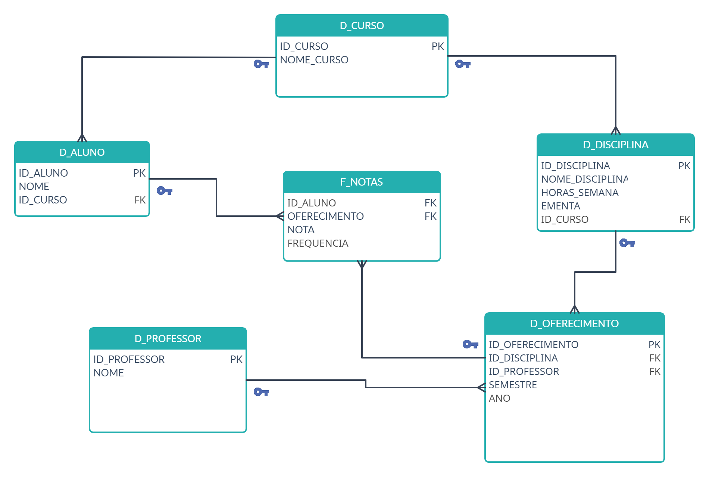

# STAR SCHEME

A tabela Fato Notas contém métricas numéricas (Nota e Frequência) e suas chaves estrangeiras relacionadas às tabelas de dimensão.
As tabelas de dimensão (Aluno, Curso, Disciplina, Professor e Oferecimento) contêm informações contextuais sobre os alunos, cursos, disciplinas, professores e os detalhes de quando as disciplinas foram oferecidas.

[Notion](https://www.notion.so/Star-Scheme-cd2441ff7eea4445be2f331d6b00ccdf?pvs=4)
